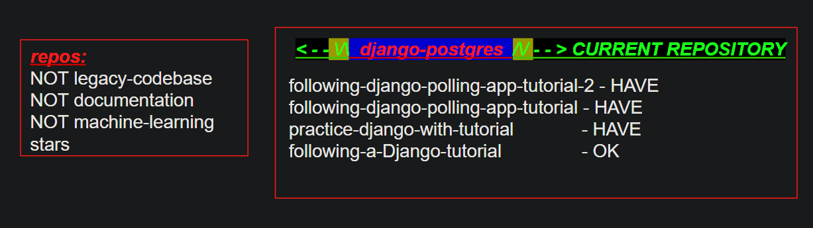

Tutorial
--------
- [PostgreSQL with Django // how to // tutorial | ![B Learning Club]](https://youtu.be/unFGJhIvHU4)(https://youtu.be/unFGJhIvHU4)

Previous Repositories
---------------------
- current / postgres [CoderSales/django-postgres](https://github.com/CoderSales/django-postgres)
- polling 2 [following-django-polling-app-tutorial-2](https://github.com/CoderSales/following-django-polling-app-tutorial-2)
- polling [following-django-polling-app-tutorial](https://github.com/CoderSales/following-django-polling-app-tutorial)
- practice [practice-django-with-tutorial](https://github.com/CoderSales/practice-django-with-tutorial)
- Django [following-a-Django-tutorial](https://github.com/CoderSales/following-a-Django-tutorial)
- [sqlite3](https://github.com/CoderSales/sqlite3)
- [django-2](https://github.com/CoderSales/django-2)

Plan
----

Shell
-----
- [script.sh](https://github.com/CoderSales/django-2/blob/main/script2.sh)
- [USE-CLI-AND-SCRIPT-SH.md](https://github.com/CoderSales/django-2/blob/main/README.md)

DEVELOPMENT.md
--------------
- [following-django-polling-app-tutorial-2/docs/DEVELOPMENT.md](https://raw.githubusercontent.com/CoderSales/following-django-polling-app-tutorial-2/main/docs/DEVELOPMENT.md?token=GHSAT0AAAAAABZB25MXSGYCI5BLEKGC2WE2ZAPYI5Q)

Bootstrap 4.5
-------------
- [Starter template](https://getbootstrap.com/docs/4.5/getting-started/introduction/)